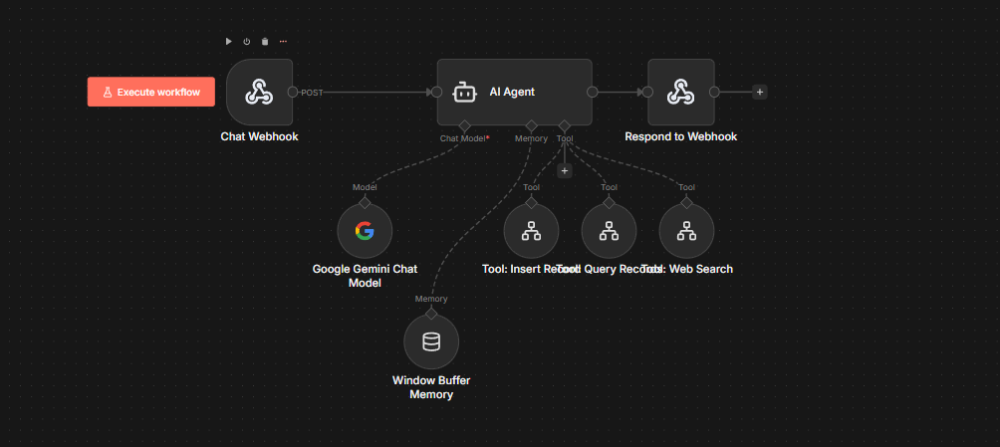

# Financial Agent

Agente inteligente de IA para gestión de finanzas personales con capacidad de razonamiento y uso de herramientas.

## Funcionalidades

- Registrar gastos, ahorros e inversiones
- Consultar y analizar registros financieros
- Búsqueda web en tiempo real (noticias, cotizaciones)
- Trazabilidad del razonamiento del agente

## Implementaciones

Este proyecto incluye dos implementaciones del mismo agente:

| Implementación | Tecnologías |
|----------------|-------------|
| [Python](./implementation-python) | Python, LiteLLM, FastAPI |
| [n8n](./implementation-n8n) | n8n, PostgREST |
| Google Cloud Platform (GCP) | CloudRun, Cloud SQL |

## Inicio Rápido

### Python

```bash
cd implementation-python

# Linux/Mac
make docker-cli

# Windows
.\make.bat docker-cli
```

### n8n

```bash
cd implementation-n8n
docker-compose up -d
# Acceder a http://localhost:5678
```




## Estructura del Proyecto

```
financial-agent/
├── implementation-python/   # Implementación en Python
└── implementation-n8n/      # Implementación en n8n
```

## Base de Datos

Ambas implementaciones usan PostgreSQL con las siguientes tablas:

- **expenses**: Registro de gastos (amount, category, description)
- **savings**: Registro de ahorros (amount, goal, description)
- **investments**: Registro de inversiones (amount, asset_type, description)

## Documentación

Consulta el README de cada implementación para instrucciones detalladas:

- [Documentación Python](./implementation-python/README.md)
- [Documentación n8n](./implementation-n8n/README.md)
